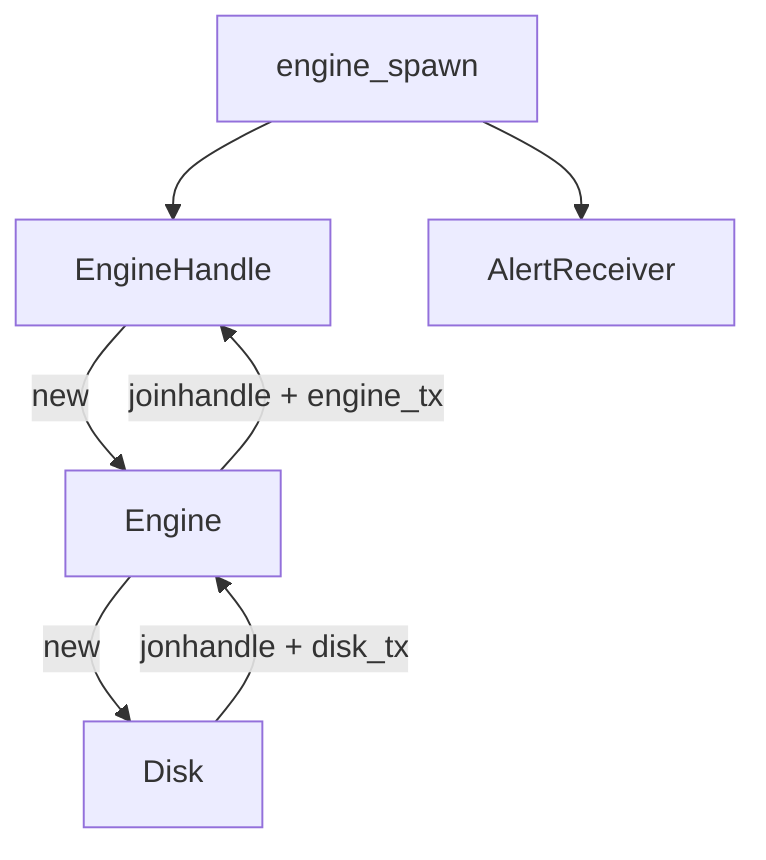
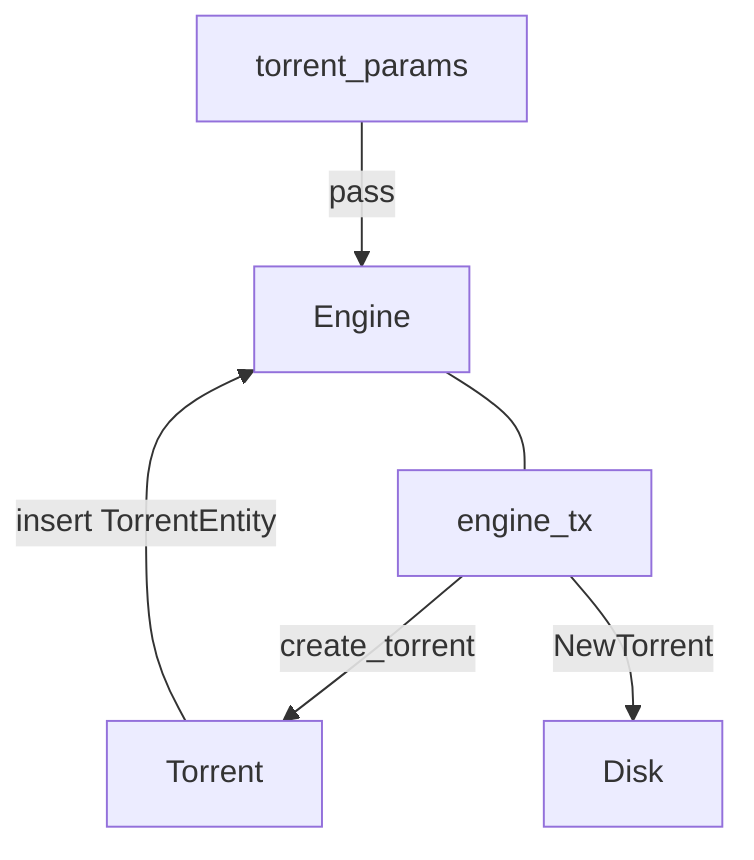
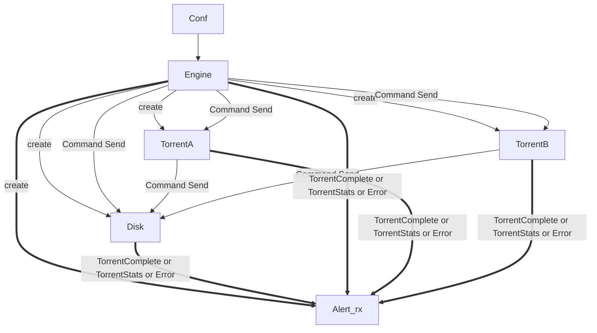
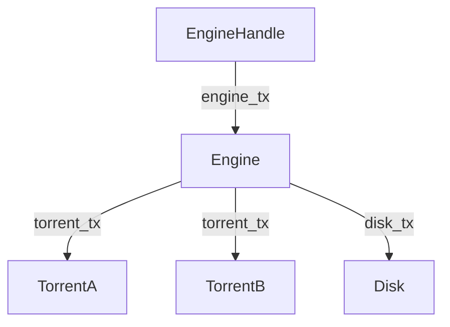

# Bittorrent downloader written by rust

This project is relevant bittorrent protocol.

Current support a [`tui`](https://github.com/kyrosle/bt-tui) program to use the downloader. I will support the win/linux/android platform
by using [`yew`](https://github.com/yewstack/yew) + [`tauri`](https://github.com/tauri-apps/tauri), that is, the application will wholly written by rust program language(with some js code for
wasm-bingen).

Create Entity Entity:

Create a Torrent file instance:

Components channels:

Shutdown() the engine and wait their joinhandle:
